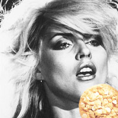

# Blondie

Minuscule php cookie param setter.

## Doc

```php
use \SSITU\Blondie\Blondie;

require_once 'path/to/autoload.php';

$Blondie = new Blondie($httponly = true, $samesite = 'None', $lifetime = 0, $path = '/');

# SSITU\Jack is required for this method; otherwise it isn't.
$protocol = $Blondie->getProtocol(); 

$Blondie->setCookie($protocol = 'http');
# aaand that's it.
```



## Contributing

Sure! You can take a loot at [CONTRIBUTING](CONTRIBUTING.md).

## License

This project is under the MIT License; cf. [LICENSE](LICENSE) for details.